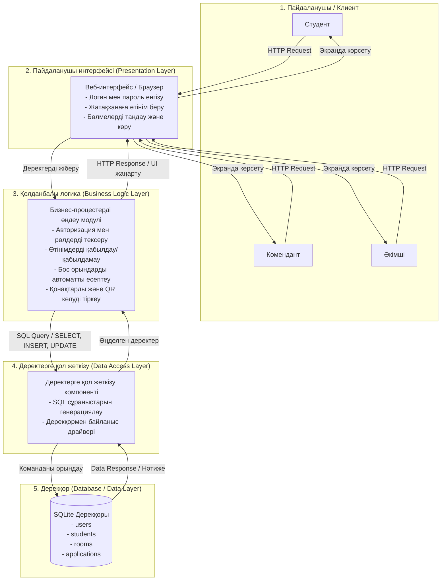

```mermaid
graph TD
    subgraph Client ["1. Пайдаланушы / Клиент"]
        A1[Студент]
        A2[Комендант]
        A3[Әкімші]
    end

    subgraph Presentation ["2. Пайдаланушы интерфейсі (Presentation Layer)"]
        B[Веб-интерфейс / Браузер<br/>- Логин мен пароль енгізу<br/>- Жатақханаға өтінім беру<br/>- Бөлмелерді таңдау және көру]
    end

    subgraph Business ["3. Қолданбалы логика (Business Logic Layer)"]
        C[Бизнес-процестерді өңдеу модулі<br/>- Авторизация мен рөлдерді тексеру<br/>- Өтінімдерді қабылдау/қабылдамау<br/>- Бос орындарды автоматты есептеу<br/>- Қонақтарды және QR келуді тіркеу]
    end

    subgraph DataAccess ["4. Деректерге қол жеткізу (Data Access Layer)"]
        D[Деректерге қол жеткізу компоненті<br/>- SQL сұраныстарын генерациялау<br/>- Дерекқормен байланыс драйвері]
    end

    subgraph Database ["5. Дерекқор (Database / Data Layer)"]
        E[(SQLite Дерекқоры<br/>- users<br/>- students<br/>- rooms<br/>- applications<br/>)]
    end

    %% Байланыстар мен деректер ағыны
    A1 & A2 & A3 -->|HTTP Request| B
    B -->|Деректерді жіберу| C
    C -->|SQL Query / SELECT, INSERT, UPDATE| D
    D -->|Команданы орындау| E
    
    E -->|Data Response / Нәтиже| D
    D -->|Өңделген деректер| C
    C -->|HTTP Response / UI жаңарту| B
    B -->|Экранда көрсету| A1 & A2 & A3
```