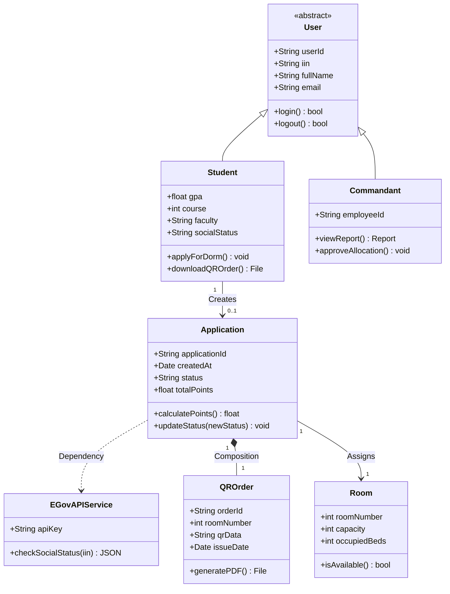

```mermaid
classDiagram
    class User {
        <<abstract>>
        +String userId
        +String iin
        +String fullName
        +String email
        +login() bool
        +logout() bool
    }

    class Student {
        +float gpa
        +int course
        +String faculty
        +String socialStatus
        +applyForDorm() void
        +downloadQROrder() File
    }

    class Commandant {
        +String employeeId
        +viewReport() Report
        +approveAllocation() void
    }

    class Application {
        +String applicationId
        +Date createdAt
        +String status
        +float totalPoints
        +calculatePoints() float
        +updateStatus(newStatus) void
    }

    class Room {
        +int roomNumber
        +int capacity
        +int occupiedBeds
        +isAvailable() bool
    }

    class QROrder {
        +String orderId
        +int roomNumber
        +String qrData
        +Date issueDate
        +generatePDF() File
    }

    class EGovAPIService {
        +String apiKey
        +checkSocialStatus(iin) JSON
    }

    User <|-- Student
    User <|-- Commandant
    Student "1" --> "0..1" Application : Creates
    Application ..> EGovAPIService : Dependency
    Application "1" *-- "1" QROrder : Composition
    Application "1" --> "1" Room : Assigns
```