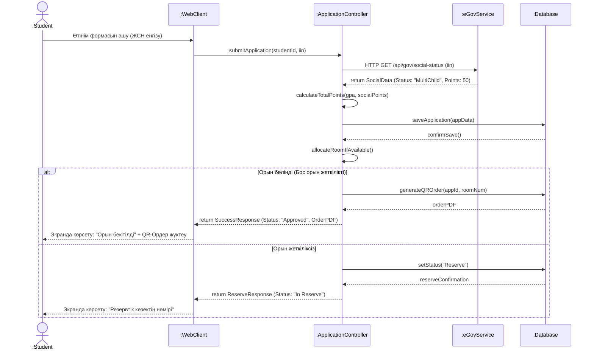

```mermaid
sequenceDiagram
    actor Student as :Student
    participant Web as :WebClient
    participant App as :ApplicationController
    participant eGov as :eGovService
    participant DB as :Database

    Student->>Web: Өтінім формасын ашу (ЖСН енгізу)
    Web->>App: submitApplication(studentId, iin)
    
    %% Сыртқы жүйемен байланыс
    App->>eGov: HTTP GET /api/gov/social-status (iin)
    eGov-->>App: return SocialData (Status: "MultiChild", Points: 50)
    
    %% Деректерді өңдеу және шешім қабылдау
    App->>App: calculateTotalPoints(gpa, socialPoints)
    App->>DB: saveApplication(appData)
    DB-->>App: confirmSave()
    
    App->>App: allocateRoomIfAvailable()
    
    alt Орын бөлінді (Бос орын жеткілікті)
        App->>DB: generateQROrder(appId, roomNum)
        DB-->>App: orderPDF
        App-->>Web: return SuccessResponse (Status: "Approved", OrderPDF)
        Web-->>Student: Экранда көрсету: "Орын бекітілді" + QR-Ордер жүктеу
    else Орын жеткіліксіз
        App->>DB: setStatus("Reserve")
        DB-->>App: reserveConfirmation
        App-->>Web: return ReserveResponse (Status: "In Reserve")
        Web-->>Student: Экранда көрсету: "Резервтік кезектің нөмірі"
    end
```