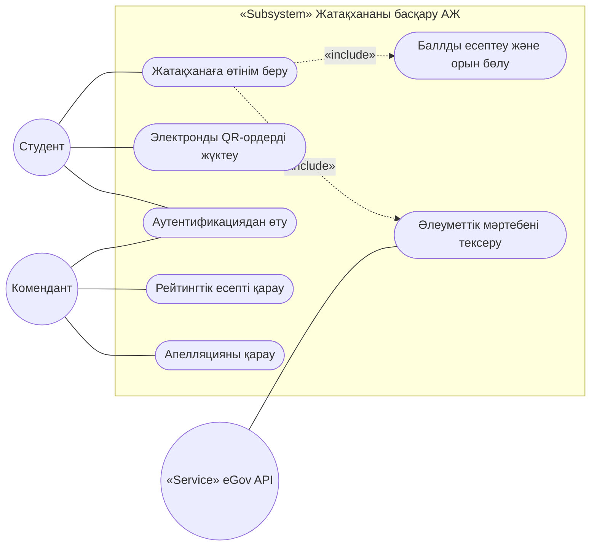

```mermaid
flowchart LR
    %% Актерлер
    Student((Студент))
    Commandant((Комендант))
    EGov(("«Service» eGov API"))

    %% Жүйе шекарасы
    subgraph System ["«Subsystem» Жатақхананы басқару АЖ"]
        direction TB
        UC1([Жатақханаға өтінім беру])
        UC2([Баллды есептеу және орын бөлу])
        UC3([Әлеуметтік мәртебені тексеру])
        UC4([Электронды QR-ордерді жүктеу])
        UC5([Аутентификациядан өту])
        UC6([Рейтингтік есепті қарау])
        UC7([Апелляцияны қарау])
    end

    %% Байланыстар
    Student --- UC1
    Student --- UC4
    Student --- UC5
    
    Commandant --- UC5
    Commandant --- UC6
    Commandant --- UC7
    
    UC1 -. "«include»" .-> UC2
    UC1 -. "«include»" .-> UC3
    
    EGov --- UC3
```